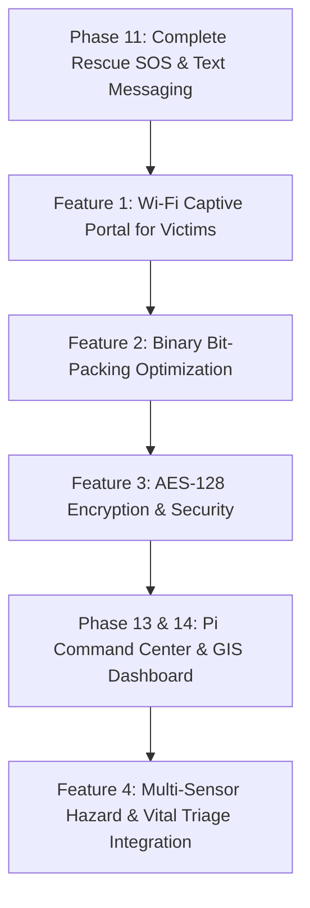

# 🛰️ Off-Grid LoRa-WiFi Self-Healing Mesh Infrastructure for Search & Rescue (SAR)

## 📌 1. Project Overview & Architecture

### 1.1 Executive Summary
The **LoRa-WiFi Mesh Infrastructure** is an autonomous, infrastructure-independent emergency communication network engineered for **Search and Rescue (SAR)** missions, disaster recovery, and remote exploration. In disaster zones (earthquakes, floods, wildland fires) or remote mountain environments where cellular towers and satellite terminals are degraded or absent, traditional communication collapses.

This project deploys an ad-hoc, multi-hop mesh network utilizing low-power **ESP32/ESP32-S3 microcontrollers**, **SX1278 (433MHz) / SX1276 (868/915MHz) LoRa transceivers**, **Neo-6M GPS modules**, and **OLED displays**. The network dynamically routes packets across multiple nodes, automatically heals around hardware failures or moving obstacles, and relays GPS telemetry and SOS alerts to a centralized **Raspberry Pi Mission Command Center**.

---

### 1.2 System Architecture Diagram

```
                 [ FIELD RESCUER / VICTIM NODES ]
 ┌────────────────┐          ┌────────────────┐          ┌────────────────┐
 │  Node A (ESP32)│ ◄──LoRa──►  Node B (S3)   │ ◄──LoRa──►  Node C (ESP32)│
 │  OLED + GPS    │  (Hop 1)  │  OLED + GPS    │  (Hop 2)  │ OLED + GPS/SOS │
 └───────┬────────┘          └────────────────┘          └────────┬───────┘
         │                                                        │
         │ Direct Wi-Fi AP                                        │ LoRa Relay
         ▼                                                        ▼
 [Smartphone Web UI]                                      ┌────────────────┐
 (No App Required)                                        │ Gateway Node   │
                                                          └───────┬────────┘
                                                                  │ UART / USB
                                                                  ▼
                                                      ┌──────────────────────┐
                                                      │ Raspberry Pi Command │
                                                      │ Node-RED/Python/DB   │
                                                      └──────────┬───────────┘
                                                                 │
                                                                 ▼
                                                      ┌──────────────────────┐
                                                      │ Offline Web GIS Map  │
                                                      │ Live SOS Dashboard   │
                                                      └──────────────────────┘
```

---

## 🛠️ 2. Core Implementation Phases (Reviewed from `PLan.md`)

| Phase | Module / Feature Name | Description & Technical Capability | Status |
| :--- | :--- | :--- | :---: |
| **Phase 1** | **Hardware Verification** | Pinout mapping, OLED initialization (SSD1306 / SH1106), and SPI LoRa module verification across ESP32 and ESP32-S3 hardware platforms. | ✅ |
| **Phase 2** | **Basic Unidirectional LoRa** | Point-to-point packet delivery from Node A to Node B with real-time RSSI signal quality rendering on OLED display. | ✅ |
| **Phase 3** | **Bi-Directional Communication** | Two-way non-blocking packet exchange using independent non-blocking timers (`millis()`) to prevent RX/TX deadlocks. | ✅ |
| **Phase 4** | **Reliable Transport Layer** | Custom protocol framing (`MSG:ID:Payload` & `ACK:ID`), duplicate packet filtering, 100ms ACK timers, and randomized exponential backoff jitter to prevent RF collisions. | ✅ |
| **Phase 5** | **Heartbeat Network Health** | Periodic node status broadcast (`HB:NODE_ID:UPTIME`), tracking online/offline state, with a 12-second timeout monitor for dead-node detection. | ✅ |
| **Phase 6** | **Dynamic Neighbor Discovery** | Dynamic array tables tracking active neighboring nodes, auto-expanding upon hearing new broadcasts, and pruning stale links automatically. | ✅ |
| **Phase 7** | **Distance-Vector Routing Table** | Decentralized route discovery (`RT:SENDER:DEST1,HOPS1;...`) with split-horizon / distance-vector loop avoidance logic. | ✅ |
| **Phase 8** | **Multi-Hop Packet Forwarding** | End-to-end packet forwarding (`DATA:SRC:DEST:HOPS:MSG_ID:PAYLOAD`) with hop TTL limits to transmit messages past line-of-sight barriers. | ✅ |
| **Phase 9** | **Self-Healing Network Mesh** | Automatic link degradation detection, immediate route invalidation upon node failure, and dynamic failover rerouting to alternative active pathways. | ✅ |
| **Phase 10** | **Real-Time GPS Telemetry** | Hardware Serial NMEA parsing via Neo-6M GPS modules, broadcasting `GPS:SRC:LAT:LON:BAT:UPTIME` telemetry with indoor bench fallback modes. | ✅ |
| **Phase 11** | **Rescue Messaging & SOS Alerts** | Directed rescue text messages (`TEXT:SRC:DEST:...`) and hardware GPIO 0 BOOT-button triggered broadcast **SOS Alerts** takeover (`🚨 SOS EMERGENCY ALERT 🚨`). | 🔄 |
| **Phase 12** | **Autonomous Search Rover** | Mobile robotic node to navigate hazardous terrain, extend network coverage automatically, and locate victims in inaccessible zones. | ⏳ |
| **Phase 13** | **Raspberry Pi Command Center** | Gateway ESP32 bridged via serial to a Raspberry Pi backend storing node positions, logs, and telemetry into an SQLite/InfluxDB database. | ⏳ |
| **Phase 14** | **Web Mission Dashboard** | Interactive offline browser dashboard with map overlays (Leaflet/Mapbox), live node diagnostics, telemetry charts, and emergency alerts. | ⏳ |
| **Phase 15** | **Field Optimization & Tuning** | Transmit power adjustments, antenna tuning, duty cycle management, and field range verification in dense urban/forest environments. | ⏳ |
| **Phase 16** | **Documentation & Final Report** | System architecture schematics, deployment guides, user manuals, and academic project report. | ⏳ |

---

## ⚡ 3. Advanced Extra Features to Upgrade Your Project

To elevate this project to **competition-winning, defense-grade, or publication-ready standards**, here are high-impact features organized by domain:

### 📶 A. Connectivity & Communications
1. **Wi-Fi Captive Portal & Off-Grid Web Interface (No App Needed)**
   - *Concept*: Every ESP32 node hosts a local Wi-Fi Access Point (e.g. SSID: `SOS_Emergency_Node_A`).
   - *Value*: Any victim or civilian with a regular smartphone can connect to the Wi-Fi. A captive portal automatically pops up in their browser, letting them type text messages or trigger an SOS without needing special apps or hardware.
2. **Adaptive Data Rate (ADR) & Dynamic Transmit Power**
   - *Concept*: Dynamically alter LoRa Spreading Factor (SF7 to SF12) and RF TX Power based on measured RSSI/SNR of neighboring links.
   - *Value*: Close neighbors talk fast using low power at SF7 (reducing airtime and energy), while distant hops automatically bump to SF12 for maximum penetration.
3. **Store-and-Forward Delay-Tolerant Networking (DTN)**
   - *Concept*: If a mobile rescue node loses contact with all mesh nodes, messages are cached in flash memory (SPIFFS / LittleFS).
   - *Value*: When the node comes back in range of any mesh member, cached rescue logs and victim coordinates automatically flush to the network.

---

### 🛡️ B. Security & Protocol Optimization
4. **AES-128-GCM Payload Encryption & Dynamic Authentication**
   - *Concept*: Encrypt all LoRa payloads using AES-128-GCM with counter-based anti-replay protection.
   - *Value*: Prevents bad actors from injecting fake Mayday signals, tampering with location data, or eavesdropping on tactical rescue positions.
5. **Binary Packed Protocol (CBOR / Bit-Packing)**
   - *Concept*: Convert ASCII text packet strings (`GPS:NODE_A:23.79781:90.44972:...`) into tightly packed binary bitfields.
   - *Value*: Reduces packet airtime by **65-80%**, drastically reducing RF collision probability and extending overall battery longevity.

---

### 🛰️ C. Location, Navigation & Victim Finding
6. **Dead-Reckoning IMU Sensor Fusion (MPU6050 / BNO055)**
   - *Concept*: Combine 6-DOF / 9-DOF Inertial Measurement Unit (IMU) data with GPS.
   - *Value*: Tracks rescuers indoors, under canopy cover, in caves, or inside collapsed structures where satellite signals are lost.
7. **Proximity Homing Beacon & Distance Estimator**
   - *Concept*: Calculate distance approximations using log-distance path loss RSSI models and trigger an onboard piezo buzzer/LED strobes.
   - *Value*: Helps search parties pinpoint an injured victim in zero-visibility conditions (fog, night, smoke) when within 30 meters.
8. **Geofencing & Out-of-Bounds Alerts**
   - *Concept*: Define safe operational perimeters inside the software dashboard.
   - *Value*: Automatically broadcasts warnings if a rescuer wanders out of safety zones or into hazardous areas.

---

### 🩺 D. Telemetry & Sensor Integration
9. **Environmental Hazard Monitoring (Gas / Air / Thermal)**
   - *Concept*: Integrate BME280 / MQ-135 sensors to transmit real-time ambient temperature, humidity, atmospheric pressure, and toxic gas/smoke levels.
   - *Value*: Alerts rescuers to fires, toxic gas leaks, or extreme hypothermia conditions in real-time.
10. **Victim Vital Signs Triage Monitor (MAX30102 / Pulse Sensor)**
    - *Concept*: Connect heart rate and SpO2 sensors to victim wearables attached to nodes.
    - *Value*: Classifies rescue priorities automatically (Triage Categories: Red, Yellow, Green) based on real-time biometric metrics.

---

### 🔋 E. Power & Hardware Resilience
11. **Solar MPPT Energy Harvesting & Battery Life Profiler**
    - *Concept*: Integrate solar charge controllers (CN3791/TP4056) with voltage divider ADC sampling.
    - *Value*: Enables nodes to run indefinitely in remote drop zones; nodes dynamically adjust sleep cycles based on solar input.
12. **Multi-Radio Cellular / Satellite Failover Bridge**
    - *Concept*: Equip the Command Center Gateway with a 4G LTE-M / NB-IoT / Iridium Satellite module fallback.
    - *Value*: Automatically relays critical SOS emergency events to national emergency services or cloud servers if local Pi storage is isolated.

---

## 🗺️ 4. Recommended Implementation Strategy for Extra Features



---

## 📄 5. Summary & Next Steps
With **Phases 1 through 10 fully verified** and **Phase 11 currently underway**, this project represents a complete, real-world off-grid mesh solution. Adding the **Wi-Fi Captive Portal**, **Binary Protocol Optimization**, and **AES Encryption** will convert this prototype into an industry-grade rescue network ready for demonstration and deployment.
